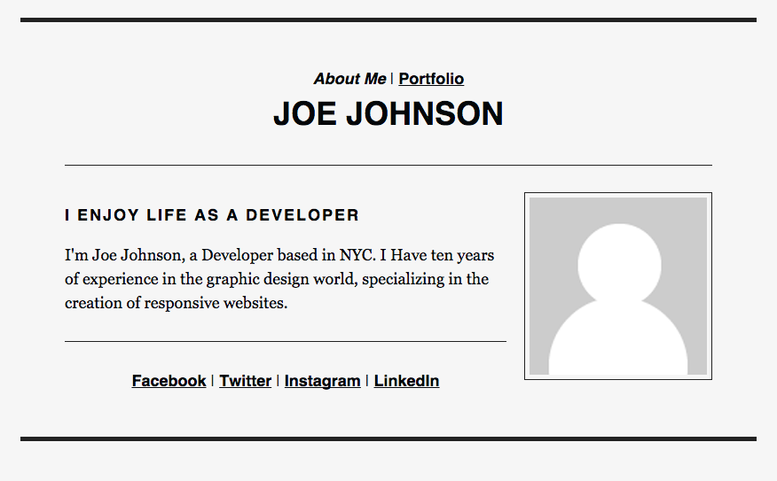
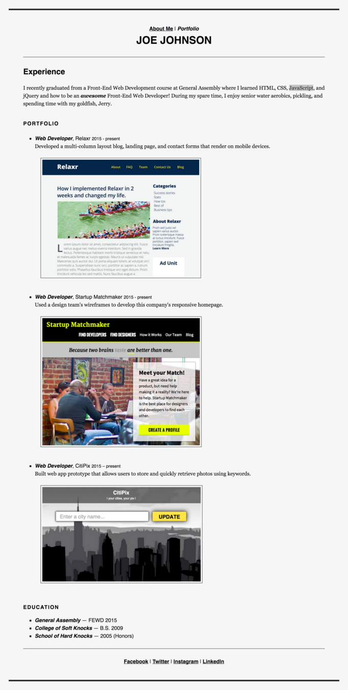

## Week 1 - Homework

* Finish building your "About" and "Portfolio" pages.

Portfolio
=================

Task
------

For your first assignment, you will begin creating the beginnings of your first website. Take what you've learned from class and build a portfolio site that showcases all of the projects you'll be completing over the next few weeks. Build two pages - an 'About Page' and a 'Portfolio' - that link to one another.

[Sample Copy](starter_code/sample_copy.txt)

Portfolio CSS
------

- Background color: #F6F6F6
- Border color: #222222
- Heading and bold text color: #030609
- Link color: #05080C 
- External Stylesheets **ONLY**
- Add in your own profile picture

Screenshots
------

